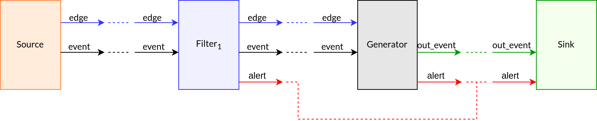

Channel description:

- edge: only edge dedicated channel
- event: events channel
- alert: direct channel from the filters (in particular the filter worker) to the sink (it does not go through the Generator, although it has it to be able to give it to the filters so that they are able to write on it)
- out_event: direct dedicated event channel between Generator and Sink.