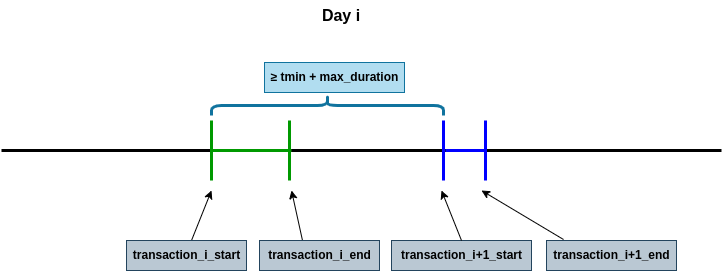

# Creation process of the Bank (Graph) Database

For simplicity and to do it in a more stepwise manner, we are going to first create all the CSV data tables for the nodes and for the relations in the corresponding format and then we will populate the Neo4j GDB with those.

# 1. Generation of the synthetic data

Based on the [Wisabi Bank Dataset](https://www.kaggle.com/datasets/obinnaiheanachor/wisabi-bank-dataset?resource=download).

## Bank

- name: string
- code: string
- loc_latitude: float
- loc_longitude: float

`bankGenerator.py`

The generation of the Banks is done taylored to our needs as we are only
considering a reduced amount of Bank entities. In particular we generated
three different Banks. `n` ATMs and `m` Cards belonging to each of them, will be
generated as explained in what follows. Note that apart from the generation
of the entities ATM and Card we will also need to generate the relationships
ATM-Bank (`belongs_to`) and Card-Bank (`issued_by`) that matches each of
these entities with the corresponding Bank entity to which they belong.

## ATM

- ATM_id: string
- loc_latitude: float
- loc_longitude: float
- city: string
- country: string

`dataGenerator.py`  

Generation of `n` ATMs given the geographical distribution of the ATMs in the Wisabi dataset. On it there are 50 ATMs distributed along Nigerian cities. The distribution of the ATMs matches the importance of the location since the number of ATMs is larger in the most populated Nigerian cities (30% of the ATM locations are in Lagos, then the 20% in Kano...).
Therefore, for generating a new ATM location first we select uniformly at random an ATM location/city from the wisabi dataset, which is directly assigned as `city` and `country` to the ATM instance, and generate new random geolocation coordinates inside a constructed bounding box of this city location to set as the `loc_latitude` and `loc_longitude` of
the ATM.

This is done by:
- First constructing a geolocation dictionary of the Wisabi cities, where we get for each city its geographical bounding box. 
- Then, for a particular ATM to be generated, a random ATM is selected from the Wisabi dataset.
- A new ATM is produced by generating a random geolocation inside the bounding box of the city location of the selected Wisabi ATM.

Note that *so far* we do not take into account for the density distribution of the ATMs of the wisabi dataset that, for each ATM location of the dataset, we have `x` number of atms.  
(*Improvement*) Have this into account for the density distribution from which we drawn the city location of the new generated ATM?

*Note: had to replace Emohua by Emuoha in the Wisabi dataset* 

## Card

- number_id: string 
- client_id: string 
- expiration: date
- CVC: int
- extract_limit: float 
- loc_latitude: float 
- loc_longitude: float

`dataGenerator.py` 

Some remarks:  

- First, in relation with the card and client identifiers (`number_id`, `client_id`),
for the moment we define that each client has 1 card, later this can be
modified.

- `Expiration` and `CVC` fields: they are not relevant, could be empty fields in-
deed or for all the Cards the same values. For simplicity and completeness
we chose them to be the same values for all the Cards.

- In the generation of each card/client we gather information about their
transactional behavior (amount avg, amount std, number of transactions per day...) based on the clients of the wisabi dataset: this will be useful for the generation of the syntethic trasactions.

Note that:
  - This behavior is gathered from 1 random client at a time of the wisabi dataset, so that we have more variability. But it could be that we assign the same behavior to all the clients, and this behavior be like a summary of all the wisabi dataset clients behavior. 
  Also the behavior could be assigned drawning it from taylored distributions selected by us ("homemade").
  - For the moment, for gathering the behavior of the wisabi clients we only consider the *withdrawal* type of transaction.

- Location (`loc_latitude`, `loc_longitude`) two possible options:
  - 1. Assign a random location of the usual ATM city/location of the
random selected wisabi customer. This way, we maintain the geo-
graphical distribution of the wisabi customers.
  - 2. Assign a random location of the city/location of a random ATM
of the newly generated ATMs objects. (*So far*)

## Transaction

- transaction_id: string
+ number_id (card id)
+ ATM_id    (atm id)
- transaction_start: datetime
- transaction_end: datetime
- transaction_amount: float

`transactionGenerator.py` 

### Remarks:

First we are generating not fraud kinds of transactions. Therefore the transactions generated for each client have to be generated in such a way that they won't produce any fraud pattern alert. Later in the process we will poison our system by generating those transactions to produce fraud pattern alerts.

The transaction generator is done to be able to generate transactions for each
of the cards based on the gathered client transaction behavior of each of the
cards for a customisable `d` number of days starting in a `start_date`.
For a card, the idea is to create a certain number of transactions per day, by linking the card to a certain ATM that is no farther than `max_distance` kms from the residence
location of the client of the card. Also, we will limit the time distance between
two consecutive transactions so that the final set of created transactions can
not produce a potential fraud related with having two transactions in different
ATM locations with an insufficient feasible time distance. For each card:  

- ATM subset: Create a subset of ATMs that are considered to be *usual*
for the card client, so that they are all at a distance inferior or equal
to `max_distance` kms to the residence location of the client of the card.
We limit the size of this subset to be of `max_size_atm_subset`, so that
we take only a maximum of `max_size_atm_subset` of the closest ATMs.
In addition, among the ATMs in this subset, preference is given to those
that are the closest to the residence location of the client and those that
belong to the same bank company as the client’s card. The transactions
generated for this card will be linked only to ATMs of this subset.

- `t_min`: Minimum threshold time in between two transactions of this client.
That is, the minimum time distance between the end of a transaction and
the start of the next consecutive transaction of a card. There are two
options for the calculation of this minimum time distance:  

  - In general: taking 2 ∗ `max_distance` kms as the upper bound on
  the maximum distance between 2 ATMs of the ATM subset, set the
  `t_min` to be the time needed to traverse that distance at 50km/h. (*for the moment*).  

  - Specifically: Taking the specific maximum distance between all the
  ATM pairs in the ATM subset to get the `t_min`.  

- For each day generate `num_tx` transactions, random number drawn from a Poisson distribution of λ = `withdrawal_day`.  

- Distribution of the `num_tx` transaction times (`transaction_start`) during
a day: we create an ordered list of `num_tx` start moments in seconds in a
day (in the range [`t_min`/2, 86400 − (`t_min`/2) − `max_duration`]) so that
all of them are at a minimum time distance of `t_min` + `max_duration`. See the following figure:

*`max_duration` limits the maximum duration of an ordinary transaction. For the moment it was set to be of 10 minutes (600s).*
Note that the interval bounds for the transaction start moments are designed in such a way that the `t_min` minimum time distance between the
end of a transaction and the start of the next transaction is also respected
between transactions belonging to different consecutive days. See the following figure:

Note that this way of generation (day by day) we are not allowing
transactions to occur in the interval marked among the two red dotted
lines of the previous figure. **Note that**: This could be fixed by looking to
the start time of the last transaction of the previous day....  
The start moments are therefore taken to define the `transaction_start` of each
of the transactions of that day. `transaction_end` is assigned a shifted
time difference with the respective `transaction_start`, in particular the
difference is drawn from a normal distribution N (300, 120) that defines
the duration of a transaction to be of mean of 5 minutes (300s) and a
standard deviation of 2 minutes (120s), bounding it to be of a maximum
time of `max_duration` of 10 minutes (600s) and setting it to the mean if
the distribution sample was negative.

Note that a limit was set on the duration of the transaction so that we
can have the control avoiding time overlapping transactions, which will be
producing irregular undesired fraud pattern alerts.  

- `transaction_amount`: based on card behavior parameters, it is drawn
from a normal distribution N (`amount_avg`, `amount_std`). If negative amount,
drawn from a uniform distribution U(0, `amount_avg` ∗ 2).
Note that this approach is done with the focus on... taking into account the
previous generated transaction: both for the linked ATM of the new transaction
and its transaction time (to avoid transactions that are overlapped or that come
one directly after the other –¿ this may be fraudulent - AVOID!)

# 2. Population of the Neo4j Graph Database

The population of the Neo4j database can be done in two possible ways:
- CSV tables imports.
- With scripts to create with cypher commands all the nodes, relations... all the database.

The explanation of this process can be seen in the golang `populatemodule` subdirectory.